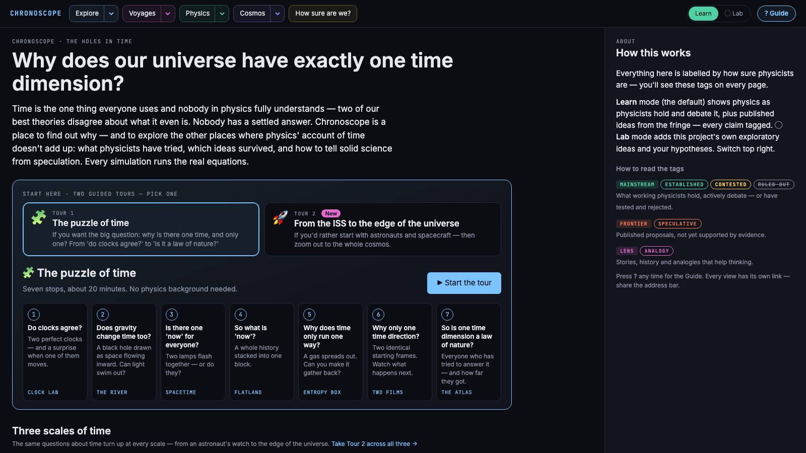
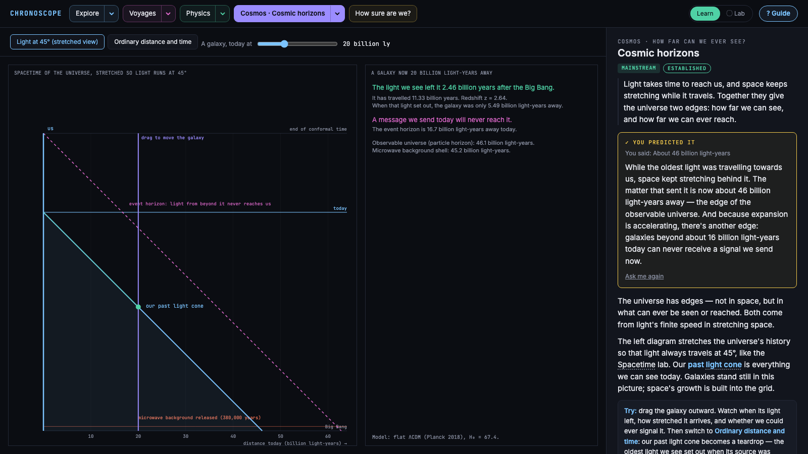
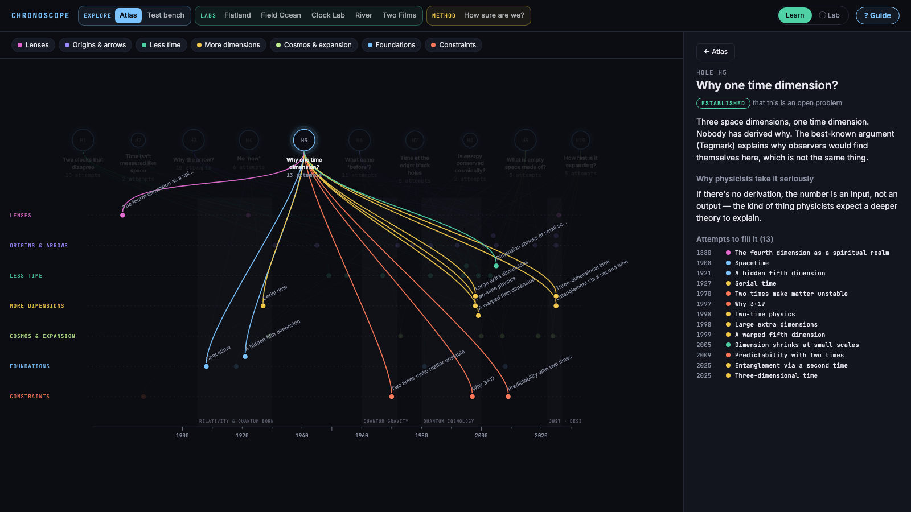
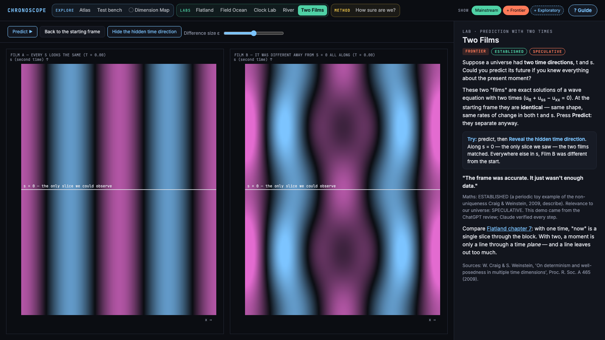

# Chronoscope — time, at every scale

A free, hands-on guide to **time in physics**, from a single photon to the edge of the universe: more than
twenty live simulations running the real equations, with every claim tagged by how sure physicists are,
so you can tell solid science from the frontier — and see where our account of time still doesn't add up.

Where it started: *why does our universe have exactly one time dimension?* The honest answer, which Tour 1
reaches, is that physics has strong constraints on it but no settled, model-independent answer.

**▶ Try it live: [willatwork-git.github.io/Physics-TimeDimensions](https://willatwork-git.github.io/Physics-TimeDimensions/index.html#home)**
· [Workbench mode](https://willatwork-git.github.io/Physics-TimeDimensions/index.html?mode=lab#home)
· [classroom edition](https://willatwork-git.github.io/Physics-TimeDimensions/index.html?edition=school#home)



## Run it locally

Download or clone the repo and **double-click `index.html`**. There is no install, build step or server.
It works offline; fonts fall back to system fonts without a connection.

| Want | Open |
|---|---|
| Learn mode (default): mainstream and frontier physics, guided | `index.html` |
| Workbench mode: exploratory ideas and your hypotheses | `index.html?mode=lab` |
| Classroom version (Learn only, no switch) | `index.html?edition=school` |

## Two modes: Learn and Workbench

Chronoscope has two audiences, split by one switch in the Guide menu.

- **Learn** (the default) — physics as physicists hold and debate it, plus published proposals from
  the fringe, all tagged. The Atlas stays uncluttered (idea names appear as you hover) and each lab
  ends with the next question and a link to where it's explored.
- **◌ Workbench** — for experimenting with ideas (the URL keeps `?mode=lab`). It adds a Workbench column under Explore: this
  project's own exploratory ideas, which deliberately challenge the mainstream, your own hypotheses
  (add, export, import) and the Dimension Map. None of it is mainstream physics; it's there to be tested.

Every view has its own link (for example `#atlas/H5` or `#flatland/7`), so you can share exactly
what you're looking at, and the browser's Back button works.

The app opens on a home page: take one of **three guided tours** (seven stops, about 20 minutes each),
explore the map, or go straight to a lab. The top bar is ⌂ Home · **Tours** (with your progress) · **Explore** (every lab, by scale) · **Guide** (the
built-in guide — or press **?** — Concepts, quizzes, and the Learn / Workbench switch). ⌂ Home is always one click away, and each side panel starts with where you are. Works on phones and tablets (the page stacks: simulation first, explanation below); the Atlas map and the 3D Flatland views are at their best on a tablet or desktop.

## What's inside

**Explore**
- **Atlas** — 11 *holes* (known gaps in our account of time, such as the problem of time in quantum
  gravity, the arrow of time, the missing "now") and around 50 *ideas* from 1880 to 2026 that tried to
  fill them. Ideas are placed by year and grouped by approach. Hover a hole to see every attempt at it.
- **Test bench** — every idea scored against the same five hurdles: matches relativity tests, keeps the
  present predictive, allows stable matter, explains the arrow, makes a new testable prediction. Every
  partial, failing or unknown score has a written reason, and you can record your own score where you
  disagree. Each idea also says what it predicts and what would overturn it. One **Filter** menu (by
  approach and by how sure) narrows both the Atlas and the Test bench.
- **How sure are we?** — a worked example (expanding space vs "tired light") showing how a claim earns
  the label *established*.

**Quantum** — time at the smallest scale
- **Delayed choice** — one photon, two routes, and a second beam splitter put in or taken out *after*
  the photon has set off. The result always matches the set-up at detection — yet nothing travels back in time.
- **The frozen universe** — a whole universe (a clock and a spin) in one unchanging quantum state.
  Seen from inside, the spin turns as the clock ticks: time from entanglement (Page–Wootters).

**Voyages** — time for people who travel
- **Mission clocks** — how much younger the ISS, a GPS satellite or a Moon base makes you (clocks on the
  Moon gain about 56 µs a day — why a lunar time standard is being set up).
- **Talking to Mars** — light delay across the solar system, the conversation drawn as a spacetime diagram.
- **Earth's energy budget** — Earth sends back all the energy it gets from the Sun, but as about twenty
  times as many photons: what it really takes in is low entropy. The arrow of time on a planet.
- **The 1 g voyage** — a steadily accelerating ship reaches the galaxy's centre in about 20 years of
  crew time, 26,000 on Earth. Plus the honest fuel bill.

**Physics labs** — small simulations that run the real equations
- **Flatland** — seven chapters in three acts (with a contents page to jump straight to the 4D chapters) on why extra dimensions are hard to picture: Abbott's Flatland, sphere
  and hypersphere slices, hypercone conics, tesseract slices and shadows, and time as a slice.
- **Field Ocean** — particles as ripples in a field (Klein–Gordon equation). A massless ripple runs at
  light speed; a massive one lags, and its internal clock slows as it speeds up.
- **Clock Lab** — the light clock, and the real relativistic corrections GPS satellites need
  (about +38 µs a day) at any altitude.
- **Spacetime** — drag events and change your speed: observers disagree about what happens "at the same
  time", but agree on the interval between events. Includes the twin paradox and the pole-and-barn puzzle,
  drawn exactly.
- **Entropy box** — a gas spreads out and never gathers back. Reverse every velocity (exactly — the
  arithmetic is integer) and it does; nudge one disc by a millionth first and it doesn't.
- **River** — a black hole pictured as space flowing inward (the Gullstrand–Painlevé "river model").
  Fire light and see where it can escape.
- **Black holes evaporate** — Hawking radiation: black holes glow, heat up as they shrink, and vanish.
  Plus the Page curve: does the information come back out?
- **Wormholes** — the complete black hole drawn so light runs at 45°, with its bridge to a second
  universe. Fire light at it: the bridge pinches shut before anything can cross.
- **Time loops** — Gödel's rotating universe, an exact solution of Einstein's equations in which
  circling far enough out, slower than light, returns you to your own past.
- **Two Films** — two exact solutions of a wave equation with *two* time directions that are identical
  at the starting frame and then diverge. With two times, a complete snapshot of "now" doesn't fix
  the future.

**Cosmos** — the universe as a whole
- **Cosmic timeline** — from the first instant physics can describe to the last black hole, in powers of
  ten, every event tagged by how sure we are; plus the universe so far as a one-year calendar.
- **Expanding universe** — stand on any galaxy; change matter and dark energy; age and fate.
- **Cosmic horizons** — how far we can see (46 billion light-years) and how far our signals can reach.
- **Boot a Universe** — try other numbers of space and time dimensions and watch what breaks.
- **The Janus point** — a gravitating swarm whose structure grows in both directions of time.





**The big picture**
- **How it all fits together** — the whole story as a comic strip: the cast (things, doers, and the rules
  every panel obeys — time only runs forward, entropy only rises), eight illustrated panels of cause and effect
  from gravity gathering gas to the last black holes evaporating, and what we don't know yet. Each panel
  links to the lab that runs the real equations. In the Guide menu.

**Learning aids**
- **Three guided tours** — *The puzzle of time* (seven stops from "Do clocks agree?" to "Is one time
  dimension a law of nature?"), *From the ISS to the edge of the universe* (six stops, out to the Cosmic timeline), and *Is time travel possible?*
  (from clocks that disagree to wormholes and time loops).
- **Threads** — each lab links to the same question at the other scales (clocks, 'now', the arrow, 3 + 1).
- **Concepts** — ⓘ markers give a short "why" on hover or tap; the Concepts pages (under Explore) tell the full
  story with the evidence: why clocks disagree, what 'now' means, the arrow of time, why 3 + 1, quantum
  time, time travel, holography, two-time physics — plus
  links to other free sites that explore each idea well.
- **Predict first** — each lab asks for your guess first and stays paused, and hidden, until you've made it
  — or chosen to read the explanation first, or explore freely; nothing is held back. "Run it" shows whether
  you were right.
- **Missions** — short, optional goals inside a lab (e.g. make the moving clock tick a third as fast; send the
  travelling twin home 10 years younger; run the gas backwards; reach Andromeda within a working life), with a
  live progress bar, a hint and "Show me". Fifteen so far, across six labs.
- **Picture it and Common trap** — each lab has one everyday analogy (and where it breaks) and one common
  misconception, with what the lab shows instead.
- **Quizzes and review** — a short quiz at the end of each tour, and questions from labs you've explored
  that come back after a day, three days, a week and longer, to check what stuck.
- **Glossary** — dotted-underlined terms show a plain definition on hover or tap.
- **Progress** — ✓ marks on what you've seen, and "continue where you left off" (kept in your browser).

**◌ Workbench** *(Workbench mode)*
- **Exploratory ideas** — this project's own challenges to mainstream physics, and your hypotheses, in one place.
- **Dimension Map** — a working framework that asks every kind of dimension (space, time, internal,
  scale, state) the same questions, to make the gaps visible.



## How claims are labelled

Every claim on screen is labelled. The labels apply to individual claims, not whole papers, because one
paper can contain established maths and speculative physics.

| Tier | Tags | Meaning |
|---|---|---|
| Mainstream | Established · Contested · Ruled out | Held, actively debated, or tested and rejected by working physicists |
| Frontier | Speculative | Published proposals without supporting evidence yet |
| Exploratory | Hypothesis | This project's own ideas and visitors' hypotheses (Workbench mode). **Not mainstream physics.** Drawn with dashed outlines |
| Lens | Analogy | History, stories and analogies that help thinking |

Learn mode shows Mainstream, Frontier and Lens; Lab adds Exploratory.

Other rules the project follows:
- Every simulation states its **model assumption** and says where it simplifies.
- Simulations use real equations. Two Films uses exact solutions, so nothing on screen can be a
  numerical artefact.
- Speculative theories (for example two-time physics, three-dimensional time) are described, not
  simulated, because a toy animation would not faithfully execute the theory and would imply
  endorsement.
- References are in [`sources.md`](sources.md), each with a confidence tag. Entries marked ☐ are still
  being checked against the primary source.

## Your own hypotheses

In Workbench mode, **+ Your hypothesis** adds an idea to the Atlas. You're asked what it would
predict and what observation would rule it out. Ideas are stored **only in your browser**
(`localStorage`); nothing is sent anywhere. **Export** saves them to a JSON file you can send a friend,
who uses **Import** to add them to their own Atlas. Imported files are treated as untrusted: only
recognised fields are kept.

## Hosting or embedding

The app is static files: `index.html`, `src/` and `docs/`, with no server code. This repo is served by
GitHub Pages from `main`. Put the folder on any other static host, or embed the classroom edition:

```html
<iframe src="https://willatwork-git.github.io/Physics-TimeDimensions/index.html?edition=school#home"
        style="width:100%;height:90vh;border:0"></iframe>
```

The only external request is Google Fonts. To make the school edition the default, set
`edition: "school"` in `src/config.js`. More detail is in [`HANDOVER.md`](HANDOVER.md).

## Project layout

```
index.html          entry point; loads the scripts below in order
src/
  config.js         edition (full / school) and mode (learn / lab)
  progress.js       the visitor's progress, predictions, tour position, own scores (browser only)
  data.js           Atlas: tags, tiers, camps, hurdles, holes H1–H7, first 25 ideas
  data2.js          Atlas expansion: holes H8–H11 and later ideas
  data3.js          what each idea predicts, what would overturn it, and a reason per bench score
  hypotheses.js     visitor hypotheses: storage, export, import
  lab.js            shared drawing helpers, lab harness, reduced-motion handling
  labs.js           Field Ocean, Clock Lab, River, Two Films
  labs2.js          Spacetime diagram, Entropy box
  quantum.js        Delayed choice, The frozen universe
  timetravel.js     Wormholes, Time loops
  deeptime.js       Black holes evaporate, Cosmic timeline, Earth's energy budget
  stops.js          the three tours' stops: question, setup, prediction, takeaway, handoff
  story.js          How it all fits together (the comic strip)
  voyages.js        Mission clocks, Talking to Mars, The 1 g voyage
  cosmos.js         Expanding universe, Cosmic horizons, Boot a Universe, The Janus point
  nav.js            the top bar: Home · Tours · Explore (mega-menu by scale) · Guide; breadcrumb
  docs.js           Dimension Map, How sure are we?
  home.js           Home page, the three tours, the four scales and the threads
  stick.js          Picture it, Common trap, tour quizzes and returning review
  flatland.js       the seven Flatland chapters (own engine)
  atlas.js          Atlas, Test bench, hypothesis form, mode switch, URL routing
  help.js           the Guide overlay
  guides.js         'The controls' — what every button and slider does, per lab
  concepts.js       Concepts pages and the ⓘ popups (the threads, core ideas, big questions, how the app works)
  glossary.js       glossary terms and hover definitions
  style.css         all styling (dark theme; colour tokens at the top)
docs/               screenshots for this README
archive/            superseded specs (v1, v2)
```

The code is plain HTML, CSS and JavaScript. Files load as classic `<script>` tags rather than ES
modules, because browsers block module imports from `file://`. Scripts share one global namespace,
`window.Chrono`.

**Adding an Atlas idea** means adding one entry to `src/data2.js`. Copy a neighbouring `E(...)` call:
id, year, name, who, camp, holes, tag, outcome, plain description, reasoning, hurdle scores, note.
**Adding a lab** means one `Chrono.lab.register({...})` call. See the existing labs in `src/labs.js`.

## Project documents

| File | Purpose |
|---|---|
| [`spec.md`](spec.md) | What each panel shows and teaches; the planned build order |
| [`DESIGN.md`](DESIGN.md) | Visual language and physics-fidelity rules |
| [`decisions.md`](decisions.md) | Decision records (D-001 onward) |
| [`sources.md`](sources.md) | References, with confidence tags |
| [`reviews/`](reviews/) | Reviews of the app: [`reviews.md`](reviews/reviews.md) (other AI systems — adopted or rejected, and why), [`learner-review.md`](reviews/learner-review.md) (a newcomer's view), the 2026-09-25 teaching and text reviews, and the [UX, flow and stickiness design spec](reviews/Chronoscope%20%E2%80%94%20UX,%20Flow%20%26%20Stickiness%20Design%20Spec.md) |
| [`todo.md`](todo.md) | Task list |
| [`ACTIVE.md`](ACTIVE.md) | Current focus |
| [`HANDOVER.md`](HANDOVER.md) | Notes for hosting and school use |
| [`learning.md`](learning.md) | The author's learning log: questions, intuitions, aha moments |
| [`CLAUDE.md`](CLAUDE.md) | Working rules for the AI collaborator |

## Status

Working and usable on desktop and phone: the Atlas, Test bench, all labs listed above across four
scales, Learn and Workbench modes, three guided tours, Concepts pages and the school edition. The roadmap is
in [`todo.md`](todo.md): next is launch readiness — verified citations, a light
theme, teacher notes, and a move to its own domain, **chronoscope.com.au**.

## Credits

Concept and direction: Will ([AgilityAI](https://agilityai.com.au)). Built with Claude (Anthropic).
Design critiques from ChatGPT, Gemini and Google AI Overview are recorded, with what was adopted and
rejected, in [`reviews/reviews.md`](reviews/reviews.md). The *Flatland* text (E. A. Abbott, 1884) is public domain.

## Licence

- **Code** (`index.html`, `src/`): [MIT](LICENSE).
- **Written documents and screenshots** (the Markdown files, `docs/`):
  [CC BY 4.0](LICENSE-CONTENT). Reuse freely with credit.
- *Flatland* excerpts (E. A. Abbott, 1884): public domain.
