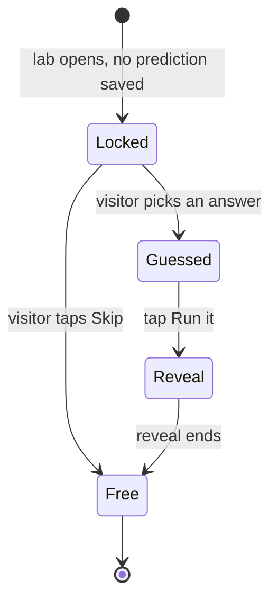
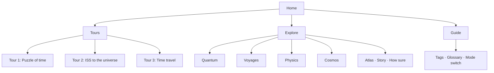

# Chronoscope — UX, Flow & Stickiness Design Spec

Sep 25, 2026 · @William

**Status (2026-09-26):** adopted as the UX roadmap (decisions.md D-042; phases in todo.md). P0 done. Will's calls: four-item top bar — yes; concrete headline — yes; Claude drafts the 21 stop plans; stay static until the domain move.

## Summary and goals

This spec changes how Chronoscope looks, reads and pulls people back, without touching the physics, the equations or the confidence tags. It puts one path in front of new visitors (the tours), makes each sim the hero of its page, and gives visitors reasons to finish and return: missions, visible progress and shareable challenges.

**Audiences**

- **Curious adult or older student** arriving cold, usually on a phone, with a few minutes to spare.
- **Space-school learner** sent by a teacher or program, working through a tour in a session.
- **Teacher or facilitator** who needs to set the site as a task and see that it was done.

**Goals and how we'll know**

| Goal | Signal (measured locally or via optional analytics) | Target |
| --- | --- | --- |
| New visitors start something | Share of first visits that open a tour stop or sim within 60 s | > 60% |
| Predictions are made honestly | Predictions answered before the sim reveals the result | 100% by design |
| Visitors finish a tour | Tour starts that reach the last stop | > 35% |
| Sims hold attention | Missions attempted per lab visit | ≥ 1 on average |
| Visitors come back | Return visits that use the resume card | Tracked, no target yet |

Out of scope: new physics content, new sims, a backend (only the optional items under Shareable challenges would need one), and changes to Workbench-mode content.

## Design principles

Every decision below is tested against these six rules. When two conflict, the earlier one wins.

1. **Honest before engaging.** The confidence tags and the mainstream-versus-frontier split never get weaker for the sake of engagement. Missions and rewards are there to serve understanding, never the other way round.
2. **One obvious next step.** Every screen has exactly one primary action. Everything else is secondary styling.
3. **The sim is the hero, but reading is a valid route.** Physics you can move is the product. Someone who only reads should still get every takeaway, and nothing is ever locked behind an interaction.
4. **Guess, then see, without being graded.** The visitor commits to a guess before the answer can be seen. The reveal compares their guess with the result and says what most people expect. It never marks them wrong.
5. **One lab, many questions.** A tour stop asks its own question of a shared lab. The physics is written once; the framing changes with the route.
6. **Phone first.** Every layout is designed at 375 px wide first, then widened. Nothing important sits below a sim on mobile if it has to be read before using that sim.

## P0: Fix the prediction step

The sim must not show the answer until the visitor has guessed. Today on Clock Lab the sim runs at 0.60c and shows γ = 1.25 while the question asks about 0.87c. On a phone the question sits below the sim, so most visitors see the answer first.

**States**



A lab opens in Locked if this visitor has never predicted on it; otherwise it opens straight in Free.

**Behaviour per state**

| State | Sim | Readouts that give the answer (γ, tick ratio, years) | Controls | Prediction card |
| --- | --- | --- | --- | --- |
| Locked | Paused on the question's exact setup (e.g. 0.87c), first frame drawn | Hidden behind a "?" chip | Disabled, dimmed | Shown above the sim on all widths, with 3 options + Skip |
| Guessed | Still paused | Hidden | Disabled | Collapses to "Your guess: …" + a Run it button |
| Reveal | Runs to a set moment (e.g. 10 ticks of the rest clock), then pauses | Counts up live, then the right number is highlighted | Disabled until the reveal ends | Shows their guess next to the result, and one line on why most people expect something else |
| Free | Normal sandbox | Shown | Enabled; first mission offered (see Missions) | Collapsed to a one-line summary |

**Rules**

- The prediction's setup is data, not prose. Each question in the bank gets a `setup` object, e.g. `{ v: 0.87 }`, that the lab applies when entering Locked. The question and the slider can then never disagree. The question belongs to the tour stop (see Tours: one experiment, several framings), and guesses are saved per lab and tour, so a Tour 1 guess never answers Tour 3's question. This fixes a bug on the live site today.
- On widths under 768 px the prediction card is rendered **above** the sim canvas as an overlay strip, not in the side column.
- Skip, labelled "Just show me", goes straight to Free and records `skipped: true`. No penalty and no nagging.
- The reveal takes 3–6 s. It respects `prefers-reduced-motion`: jump to the end frame and show the number.

**Acceptance criteria**

- [ ] On every lab with a prediction, no answer-bearing number is visible in Locked or Guessed, at 375 px and at 1280 px.
- [ ] The question's values and the sim's starting values match for every question in the bank (checked by a script that runs over the bank).
- [ ] A visitor who has already predicted lands in Free on return visits.

## Navigation and site structure

The top bar goes from 9 controls to 4: Home, Tours, Explore and Guide, plus the mode switch tucked into Guide. Tours become the main route through the site. The four scales become the library. The threads stop being their own section.

**Site map**



Every lab page is reachable from Explore. Tours link to the same pages; they just order them.

**Top bar**

| Width | Layout |
| --- | --- |
| ≥ 1024 px | Wordmark · Tours · Explore · Guide, left-aligned in one row. Progress ring on the right (see Progress). |
| 768–1023 px | The same, with shorter labels if needed. Must never wrap to two rows. |
| < 768 px | Wordmark + progress ring + a Menu button that opens a full-screen sheet: Continue, Tours, Explore by scale, Guide. |

- **Explore** opens a mega-menu: 4 columns (one per scale, each in its existing accent colour) listing the labs, plus a bottom row for Atlas, Story and How sure. The current page is highlighted. Pages already seen get a small tick.
- **Tours** opens a 3-card menu showing each tour's progress (e.g. "3 / 7").
- A breadcrumb (Home › Physics › Clock Lab) stays at the top of the side column, as it is now.

**Naming changes**

| Current | New | Why |
| --- | --- | --- |
| Learn / Lab mode | Learn / Workbench mode | "Lab" already means a sim page (Clock Lab, eyebrow "LAB · …") |
| Mode switch in the top bar | Inside the Guide menu, with a Workbench badge in the bar only when it's on | Most visitors never need it. It should still be clear when it's on. |
| Threads (Clocks disagree, Light and 'now', ...) | "Where this leads" links at the end of each lab | They repeat what the tours do. The links keep the connections without adding another section to navigate. |
| "Tour paused" banner | A "Resume Tour 1 · stop 3" chip in the top bar | The banner currently shows on every page after you leave a tour, including Home. |

## Home page

The home page gets one job: get a first-time visitor into Tour 1 within 10 seconds, and get a returning visitor back to where they left off. It drops from 9 blocks to 5, and the right-hand sidebar is removed.

**Block order, top to bottom**

| # | Block | First visit | Returning visit |
| --- | --- | --- | --- |
| 1 | Continue card | Hidden | "Continue: Tour 1 · stop 3, Is there one 'now'?" plus a thumbnail of that sim. This is the primary button. |
| 2 | Hero | Headline, one sentence, a live sim, and a "Start Tour 1" primary button | Same, but the button is secondary |
| 3 | Pick a tour | 3 cards in a row (stacked on mobile), each showing length, number of stops and progress | Progress filled in, finished tours stamped |
| 4 | Four scales | 4 compact tiles that open Explore, filtered to that scale | Ticks on labs already seen |
| 5 | Go deeper | 3 small cards: Atlas, Story, How sure | Same |

**Hero sim**

- A cut-down light clock: the rest clock and a moving clock side by side, looping, with the tick counters showing, about 360 px tall on desktop and 220 px on mobile.
- One control only: a speed slider under the clocks, labelled "Drag me". Moving it shows the effect immediately, which is the hook.
- The canvas is drawn by the same code as Clock Lab (same module, `hero: true` flag). No separate copy of the physics.
- Performance limit: paused when off-screen (IntersectionObserver) and capped at 30 fps on mobile.

**Headline copy (to review)**

- Eyebrow: *Chronoscope · time, at every scale*
- H1: *Two perfect clocks. One is moving. They disagree.*
- Sub: *Twenty-plus live simulations running the real equations. Every claim tagged by how sure physicists are.*

**What moves off the home page**

| Current block | New home |
| --- | --- |
| Tour 1's 7-stop grid | The Tour 1 page, and the Tours menu |
| "How this works" sidebar with the tag legend | A one-time explainer the first time a tag is tapped, plus Guide › Tags |
| Four threads | "Where this leads" on each lab page (section 6) |
| "You've explored 0 of 27" line | The progress ring in the top bar (see Progress) |

## Lab page template

Every lab page follows one fixed order, so visitors learn the rhythm once: guess, run, understand, take on a mission, move on. The controls table and the "Try:" boxes go away; their content moves onto the controls themselves and into missions.

**Layout**

| Zone | Desktop (≥ 1024 px) | Mobile (< 768 px) |
| --- | --- | --- |
| Tour strip | Full width above both columns: "Tour 1 · 2 / 7", the question, ← and Next → | Same, sticky at the top, 56 px tall |
| Sim | Left column, about 60% of the width | Full width, first on the page |
| Prediction or mission card | Top of the right column | Directly above the sim (see P0) |
| Explanation | Right column, scrolls | Below the sim |
| End card | Bottom of the right column | Bottom of the page |

**Right-column order**

1. Breadcrumb, title and confidence tags (unchanged).
2. One-sentence setup (unchanged).
3. Stop question (in a tour) or the lab's own question, then the prediction card with a "Read the explanation first" link beside it. That link jumps to step 4 and unlocks the sim; nothing is gated. The mission card follows once the visitor has guessed or skipped.
4. Explanation, no longer than 3 short paragraphs. The formula goes behind a "For the technically minded" toggle, which already exists.
5. Picture it (the analogy, tagged ANALOGY) and Common trap, both from `stick.js`. Collapsed by default, one line each.
6. End card (below).
7. Sources, in smaller text.

**Inline control hints**

- Each control gets a short hint (up to 12 words) directly under it, e.g. under the speed slider: *Faster = longer diagonal path for the light*.
- The first time a visitor hovers or focuses a control, the full description from today's controls table appears as a popover. After that it's available through an "i" icon.
- The controls table is removed. Its text is kept in the data as `controls[].help`.

**End card**

- **What you just saw:** one sentence. This is the existing "Remember" text where there is one.
- **Primary button:** in a tour, Next, under the stop's handoff sentence; otherwise the most closely related lab.
- **Where this leads:** 2–3 links taken from the old threads, each with its scale label (Quantum, Voyages, Physics, Cosmos).
- **Review line:** "You'll get a quick question about this in 3 days" if the lab has review questions (see Progress).

## Tours: one experiment, several framings

A lab is a piece of physics. A tour stop is a question asked of that lab. Separating the two lets the same Clock Lab answer "do clocks agree?" in Tour 1 and "can you arrive in someone's future?" in Tour 3, without two copies of the explanation drifting apart. This section is how content flow gets fixed; the lab template in section 6 is the frame it sits in.

**Two layers**

| Layer | Owns | Written once per |
| --- | --- | --- |
| Lab | Sim, controls, core explanation, confidence tags, Picture it, Common trap, sources, missions | Lab (27) |
| Stop | The question the visitor arrives with, the starting setup, the prediction (if any), the one thing to look at, the takeaway, the handoff to the next stop | Tour × stop (21 across three tours) |

Opening a lab outside a tour uses a neutral framing, the lab's own title and setup, so Explore visits keep working as now.

```
STOPS["timetravel"][1] = {
  lab: "clocks",
  ask: "Can you arrive in someone else's future?",
  setup: { v: 0.99 },
  predict: "tt-clocks-1",          // a question id in the bank, or null
  look: "Years passed on each clock for the same trip",
  takeaway: "Yes, forwards only: the fast traveller ages less and steps into Earth's future.",
  handoff: "Forwards is easy. Backwards needs spacetime itself to loop — can it?"
}
```

**Clock Lab, three ways in**

| Arriving from | Question | Starting setup | Look at |
| --- | --- | --- | --- |
| Tour 1 · Puzzle of time | Do two perfect clocks agree? | 0.87c, light-clock mode | Tick counts side by side |
| Tour 3 · Time travel | Can you arrive in someone else's future? | 0.99c, a trip counter in years | Years passed on each clock |
| Explore | How does speed change a clock? | 0.60c (as now) | γ and the budget bars |

**The stop plan (write this before redesigning any screen)**

Each of the 21 stops gets a one-row plan with these fields. Laid out as one table per tour, it shows repetition and weak links at a glance.

| Field | Question it answers |
| --- | --- |
| Arrives with | What is the visitor wondering at this point in the tour? |
| Already knows | What did earlier stops on this tour establish? |
| New here | The one distinction this stop adds |
| Do | One action, under a minute |
| Look at | Where on screen the evidence appears |
| Takeaway | One or two sentences they could say out loud |
| Limit | What the sim simplifies, or what's unknown (with its tag) |
| Handoff | The open question that makes the next stop necessary |

**Rules that come out of it**

- **Handoffs make an argument, not a label.** The tour strip's Next button keeps its short label, and the handoff sentence sits just above it on the end card. Every handoff is checked for physics accuracy like any other claim.
- **Don't re-explain what this tour already covered.** If a concept was covered earlier on the same tour, the lab's intro collapses to one line: "You met this at stop 2 — open for the full explanation."
- **Predictions are saved per framing.** A guess made in Tour 1 never carries into Tour 3's question on the same lab; storage keys become `lab:tour:question`. A "Restore my last setup" link lets people pick up their own slider settings if they want.
- **Threads survive as data, not as a section.** The four cross-scale threads become sequences of labs that feed each lab's "Where this leads" block and a "Follow an idea across scales" row in Explore. They could become a fourth, lighter kind of tour later.

## Visual system

Keep the dark theme and the four scale colours, but separate things into three clear levels: the sim at full brightness, content in normal text, and page furniture in quiet grey. Today everything is a bordered dark box at the same brightness, so nothing leads.

**Three levels of emphasis**

| Level | What sits here | Treatment |
| --- | --- | --- |
| 1 · Stage | Sim canvas, prediction and mission cards, the primary button | Brightest surface, no border, soft glow in the scale colour, largest type (readouts 28–40 px) |
| 2 · Content | Explanation, end card, tour strip | Body text at 16 px, line-height 1.55, text colour at least 7:1 contrast against the page |
| 3 · Chrome | Nav, breadcrumbs, eyebrow labels, sources | Monospace small caps only here, 12 px, secondary grey at least 4.5:1 |

**Tokens (add to the CSS `:root`)**

| Token | Role |
| --- | --- |
| `--bg`, `--surface-1`, `--surface-2` | Page background, content cards, stage (the lightest) |
| `--text`, `--text-2`, `--text-3` | Body, secondary, chrome |
| `--quantum`, `--voyages`, `--physics`, `--cosmos` | The existing scale colours, one per scale |
| `--accent` | Primary buttons and focus rings (today's blue) |
| `--ok`, `--miss` | Prediction right / wrong, mission complete |
| `--radius-s/m/l`, `--space-1–8` | 6/10/16 px corners; a 4 px spacing grid |

Borders are used only to separate things inside a card, never around every card. Cards are told apart by surface colour.

**Sims**

- The sim fills its zone. The light clock's mirrors are about 40% apart today, leaving most of the panel empty. Scale the geometry to about 80% of the canvas height.
- Every sim gets a fixed readout bar under the canvas: at most 3 big numbers, each labelled. For example "Rest 10 ticks · Moving 8 ticks · γ 1.25".
- Moving things get a short fading trail, and events (a tick, a bounce) get a brief pulse, so change is visible without reading the numbers.
- The Atlas gets a minimum canvas width of 900 px, scrolls sideways inside its own frame on smaller screens, and offers a list view on mobile. Labels no smaller than 12 px.

**Motion and accessibility**

- All animation honours `prefers-reduced-motion`.
- Everything clickable is at least 44 × 44 px on touch screens.
- Sliders can be driven from the keyboard (arrow keys; Shift + arrow for big steps).
- Keyboard focus is always visible, using `--accent`.

## Missions

Each lab gets 2–3 missions: short, checkable goals that turn the "Try:" hints into something you can pass. This is the biggest change for stickiness. The sims already calculate everything needed to check success; missions only watch values the sim already computes.

**Data model** (one new file, `src/missions.js`, keyed by view like the question bank in `stick.js`)

```
MISSIONS.clocks = [
  { id: "half", title: "Make the moving clock tick half as fast",
    check: s => Math.abs(s.gamma - 2) < 0.05,
    hold: 1500,                         // must stay true for 1.5 s
    reveal: "That's 0.866c. Light speed is the limit of this process, not a wall you hit.",
    tier: 1 },
  ...
]
```

- Each lab exposes a read-only state object `s` once per frame (e.g. `gamma`, `ticks`, `v`). This is the only change needed inside each lab.
- `hold` stops people passing by chance while dragging a slider through the target.
- Tiers: 1 = done by playing, 2 = needs the idea, 3 = a stretch goal. Only the next unfinished tier is shown.

**Card behaviour**

- After the prediction, the mission card shows the next mission: title, a thin progress bar where the target can be measured, and a Hint link that reveals the old "Try:" text.
- On success: a short pulse in the sim, a tick in `--ok`, the one-line reveal, then "Next mission" or "Next stop →".
- Missions are always optional. The tour's Next button is never locked behind them.

**Example missions for the first labs** (values to be checked against each lab's code)

| Lab | Tier 1 | Tier 2 | Tier 3 |
| --- | --- | --- | --- |
| Clock Lab | Make the moving clock tick half as fast (γ = 2) | GPS mode: find the height where the two effects cancel | Get 100 rest ticks while the moving clock makes 10 |
| Entropy box | Remove the partition and watch it fill | Reverse every velocity and get 95% of the discs back in the left half | Nudge one disc, reverse, and explain in one tap why it fails (multiple choice) |
| The 1 g voyage | Reach Proxima Centauri in less than 4 years of ship time | Reach the galactic centre within 25 years of ship time | Reach Andromeda within one working life (40 years) |
| Talking to Mars | Find the shortest possible delay | Send a question and get the answer back in under 10 minutes | Work out when "now on Mars" stops having one meaning |
| The River | Get a light pulse out from just outside the horizon | Find the point where no light can escape | — |

**Guardrails**

- A mission never states or implies anything beyond the lab's own confidence tag. Missions on FRONTIER or SPECULATIVE labs are framed as "see what this proposal predicts", never "prove".
- There are no points, leaderboards or streak penalties. The reward is the reveal and a tick on the map (see Progress). Mission text describes an effect to produce ("make the moving clock tick half as fast"), never "correct" or "fail", and every mission has a "Show me" button that sets it up for visitors who'd rather watch.

## Progress, resume and passport stamps

Progress is already saved in the browser (`chronoscope.progress.v1`). This section makes it visible and gives people reasons to come back. Everything stays in the browser; nothing is sent anywhere.

**Progress ring (top bar)**

- A ring showing the share of labs visited, e.g. 7 / 27. Tapping it opens the Passport.
- It fills as labs are visited. A finished mission adds a small dot around the ring's edge.

**Resume**

- `d.last` and the tour position already exist. The home Continue card (section 5) uses them.
- "Continue" also appears in the mobile menu sheet.
- If the last visit was more than 14 days ago, the card also offers "Quick recap first?": the "What you just saw" line from each lab visited on that tour.

**Passport** (new view, `#passport`)

| Element | Earned by | Shows |
| --- | --- | --- |
| Tour stamp | Reaching the last stop of a tour | Illustrated stamp with the date, e.g. "Puzzle of time · 25 Sep 2026" |
| Scale page | Visiting the labs of that scale | Grid of labs; ticks for visited, stars for each mission done |
| Prediction record | Answering predictions | "12 predictions · 7 right", plus a list of the ones you got wrong, each linking back to its lab |
| Review due | The existing 1/3/7/16/35/80-day review schedule | "3 quick questions ready", which opens a 60-second review |

- The passport fits the Voyages theme and the space-school audience. Stamps are one SVG each, drawn once, in the scale's colour.
- "Save my passport" downloads a small JSON file, and "Load passport" restores it. That covers moving to another device, or storage being cleared, without needing accounts.

**Review prompts**

- When questions are due, show one small chip on the home page: "3 questions ready · 1 min". No pop-ups, no badges.
- The review is a sheet of up to 5 questions. A right answer moves the question up the schedule; a wrong one sends it back to 1 day and links to the lab.

**Limit to be honest about:** without email or push notifications, reviews only happen if the visitor comes back of their own accord. Teacher mode (see Shareable challenges) is the realistic way to bring people back.

## Shareable challenges and teacher mode

Most of this works without a backend: a challenge or a class assignment is just a link with its details in the URL. Only showing how everyone else answered needs a server, so that part is optional and comes last.

**Challenge links (no backend)**

- After a reveal, a Share button builds a link like `#voyage?c=gc&g=2`. It means "the galactic-centre prediction; the sender guessed option 2".
- The person who opens it sees: *"Your friend guessed about 26,000 years. What's your guess?"* That leads into the normal prediction flow. The reveal then shows both guesses next to the answer.
- On phones it uses the system share sheet (`navigator.share`); elsewhere it copies the link. The link contains no personal data, only the question and the option number.

**Teacher mode, level 1 (no backend)**

- A "For teachers" page (in Guide) lets a teacher pick a tour or a set of labs, choose whether missions are required, and generate a class link such as `#class?t=puzzle&m=1&n=Year9-Physics`.
- A student opening the link sees a class banner, the set route, and at the end a **completion code**: a short code made from the stops done, missions passed and predictions right, with a simple checksum.
- The teacher pastes the codes into a checker on the same page, which decodes each into a line like "7/7 stops, 11 missions, 5/7 predictions right". It's easy to fake for a determined student, which is acceptable at this stage.
- There's a printable worksheet per tour (a print stylesheet): one page with the 7 prediction questions and space to write, for classes without devices for every student.

**Teacher mode, level 2, and showing what others guessed (needs a backend, optional)**

| Feature | Needs | Rough cost |
| --- | --- | --- |
| "63% of visitors guessed 'About 1'" on every reveal | An anonymous counter per question and option | Small: one serverless function and a key-value store, free-tier scale |
| Live class dashboard for teachers | Class codes, per-student records, sign-in | Significant: accounts, privacy and data retention for minors |

The first row is worth doing: seeing that most people guess wrong is a strong hook. The second should wait until spaceschool.com has said what it needs, and it brings obligations around student data.

## Phasing and effort

Five phases, each releasable on its own. Phase 0 is writing, not code. Phase 1 proves the whole model on one lab before anything is rolled out. Effort is in focused working days, with Claude implementing and Will reviewing; treat these as rough estimates until I've read the full codebase.

| Phase | Scope | Main files touched | Effort | Done when |
| --- | --- | --- | --- | --- |
| 0 · Stop plans | Plans for all 21 tour stops; list of which labs are reused across tours; flag repeated explanations and weak handoffs. Claude drafts from the live copy, Will edits | A new tab in this doc, then `STOPS` data | 1–2 days, plus Will's review | Every stop has a takeaway and a handoff Will has signed off for accuracy |
| 1 · Clock Lab prototype | Clock Lab in Tour 1, Tour 3 and Explore: stop framings, per-tour prediction keys, prediction locking, reader path, 2 missions, end card with handoff. Then the River, to test a different kind of sim (boundary, not slider). Plus the quick wins: Continue card, tour chip, and the fix so a prediction never shows its answer early | `stick.js`, `progress.js`, `labs.js`, `labs2.js`, `home.js`, new `stops.js`, new `missions.js` | 3–4 days | Five first-time visitors pass the checks below on Clock Lab |
| 2 · Structure | New top bar and Explore menu; home cut to 5 blocks with hero sim; lab template on every lab; renames | `nav.js`, `home.js`, `index.html`, CSS, `guides.js`, `docs.js` | 3–5 days | Nav never wraps between 768 and 1440 px; every lab uses the template |
| 3 · Roll out | Stop framings and prediction locking on all 21 stops; tokens and emphasis levels; sim scaling and readout bars; missions for the Tour 1 labs, then the rest | CSS, all lab files, `stops.js`, `missions.js` | 5–7 days | Contrast checks pass; each tour reads start to finish without repetition |
| 4 · Return loop | Passport, review sheet, challenge links, teacher mode level 1, worksheets; optional guess counter | `progress.js`, new `passport.js` and `teach.js`, print CSS | 4–6 days (+1–2 for the counter) | Class link to completion code to checker works end to end |

**Testing for every phase**

- Automated Playwright runs at 375 × 812 and 1280 × 800 across all 27 views: no console errors, no horizontal page scroll, and no answer numbers visible while a prediction is locked.
- A script that checks each stop's `setup` values against its lab's valid ranges, and that no two tours share a prediction key.
- Visitor checks, with five first-time visitors (ideally from the space-school audience), unprompted. Each should be able to:
  - say which tour they're on and what to do next
  - reach the explanation without touching the sim, and the sim without reading
  - describe what changed in the sim and what it means, in their own words
  - leave the tour, wander, and get back to their stop
  - meet Clock Lab a second time through another tour and see why it's asking something new
- Watch where people hesitate and which explanations they open. A longer visit only counts as success if the visitor could explain what they did.

**Keep as is:** the confidence tags and their colours; the mainstream/frontier split and Workbench mode's content; the one-link-per-view address system; the spaced-review schedule; every physics module.

## Open questions

- [ ] **Hero sim:** the light clock (clean, instant "aha") or the entropy box (more visually striking, slower to get)? The spec assumes the light clock.
- [ ] **Headline:** keep the current big-question headline, or switch to the concrete one in the Home page section?
- [ ] **Stop plans:** should Claude draft all 21 from the live copy for you to edit, or will you write the takeaways and handoffs yourself and have Claude fill in the rest?
- [ ] **Predictions on every stop, or only some?** The spec keeps predict-first where a stop has a clear surprise and leaves it out elsewhere. Worth deciding per stop in Phase 0.
- [ ] **Space school's needs:** do they want teacher mode at all, and would they host the guess counter or class data themselves? This decides whether teacher mode level 2 happens.
- [ ] **Anonymous guess counter:** OK to add one small serverless endpoint, or stay fully static?
- [ ] **Analytics:** add privacy-friendly page analytics (e.g. Plausible) to measure the goals in the Summary, or rely on the visitor checks?
- [ ] **Scope check:** this spec is based on 7 of 27 views. Workbench mode, the tour quizzes and the Guide weren't reviewed and may need their own additions.
- [ ] **Codebase access:** connect the Physics-TimeDimensions folder so Phase 0 and Phase 1 can start and the effort estimates can be firmed up.
